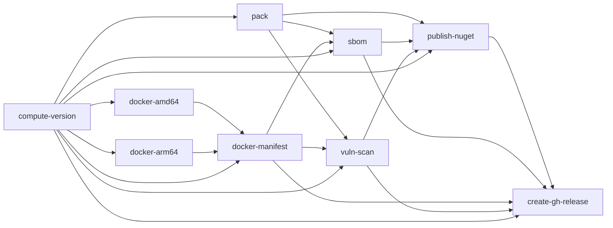

# Release pipeline

The `release` workflow (`.github/workflows/release.yml`) cuts an
automated dev pre-release on every push to `master`. Stable releases
still cut through the manual `MTConnect.NET.Builder` flow; that will
migrate in a follow-up PR once the dev cadence has been observed in
production.

## Trigger

Push to `master`. Every merged PR fires the workflow exactly once,
serialised by a `concurrency` group so a rapid succession of merges
collapses into the latest push and cancels any in-flight prior run.

## Jobs

| Job | Runner | `needs:` | Purpose |
| --- | --- | --- | --- |
| `compute-version` | `ubuntu-latest` | — | Runs `tools/ci/semver-bump.ts` to derive `<version>-dev.<N>` from the commit range since the last stable tag. |
| `pack` | `ubuntu-latest` | `compute-version` | `dotnet pack MTConnect.NET.sln -c Release`, uploads every `.nupkg` + `.snupkg` as the `nupkg` artefact. |
| `docker-amd64` | `ubuntu-latest` | `compute-version` | Native `linux/amd64` image via `docker buildx build`, pushed as `<image>:<version>-amd64`. |
| `docker-arm64` | `ubuntu-24.04-arm` | `compute-version` | Native `linux/arm64` image, pushed as `<image>:<version>-arm64`. |
| `docker-manifest` | `ubuntu-latest` | `compute-version`, `docker-amd64`, `docker-arm64` | Merges the two per-arch tags into a single multi-arch tag `<image>:<version>` via `docker buildx imagetools create`. |
| `sbom` | `ubuntu-latest` | `compute-version`, `pack`, `docker-manifest` | SPDX SBOMs — `Microsoft.Sbom.DotNetTool` over the `.nupkg` set + `anchore/sbom-action` (syft) over the merged image. |
| `vuln-scan` | `ubuntu-latest` | `compute-version`, `pack`, `docker-manifest` | `aquasecurity/trivy-action` scans the `.nupkg` set and the Docker image; SARIF uploaded to the Security tab. |
| `publish-nuget` | `ubuntu-latest` | `compute-version`, `pack`, `sbom`, `vuln-scan` | `dotnet nuget push` every `.nupkg` to nuget.org via `NUGET_API_KEY`. |
| `create-gh-release` | `ubuntu-latest` | `compute-version`, `publish-nuget`, `sbom`, `docker-manifest`, `vuln-scan` | `gh release create v<version> --prerelease` with SBOMs + `.nupkg`s attached and the Docker image ref in the notes. |

The same graph as a mermaid diagram:

## Semver-bump algorithm

`tools/ci/semver-bump.ts` implements the shape approved on Discussion
#175 (2026-08-16). The steps:

1. Look up the most recent stable tag (`vX.Y.Z`, no pre-release
   suffix). Fall back to `v0.0.0` on a first-time run.
2. Walk the commits from that tag to `HEAD`, parse each as a
   Conventional Commit, and pick the highest bump kind:
   `BREAKING CHANGE` → major, `feat` → minor, everything else →
   patch.
3. Count the commits since the most recent stable-cut marker
   (`chore(release): publish new stable`) or the most recent existing
   `vX.Y.Z-dev.N` tag. That count becomes `N`.
4. Emit `<bumped>-dev.<N>` on stdout and (when `--github-output` is
   passed) into `$GITHUB_OUTPUT` under key `version`.

## Secrets

| Name | Used by | Notes |
| --- | --- | --- |
| `NUGET_API_KEY` | `publish-nuget` | Classic nuget.org API key. Phase 1 does not use OIDC; SignPath is deferred. |
| `DOCKERHUB_USERNAME` | `docker-amd64`, `docker-arm64`, `docker-manifest`, `sbom`, `vuln-scan` | Docker Hub account owning the `trakhound` namespace. |
| `DOCKERHUB_TOKEN` | as above | Personal access token scoped to `trakhound/mtconnect-agent` writes. |
| `GITHUB_TOKEN` | `create-gh-release` | Auto-provisioned; `contents: write` scope. |

## Explicit non-scope

Docker image signing (cosign), .nupkg signing (SignPath), and the
stable-release cadence are all follow-up work — no secret placeholders
or scaffolding for those exist in this workflow.
